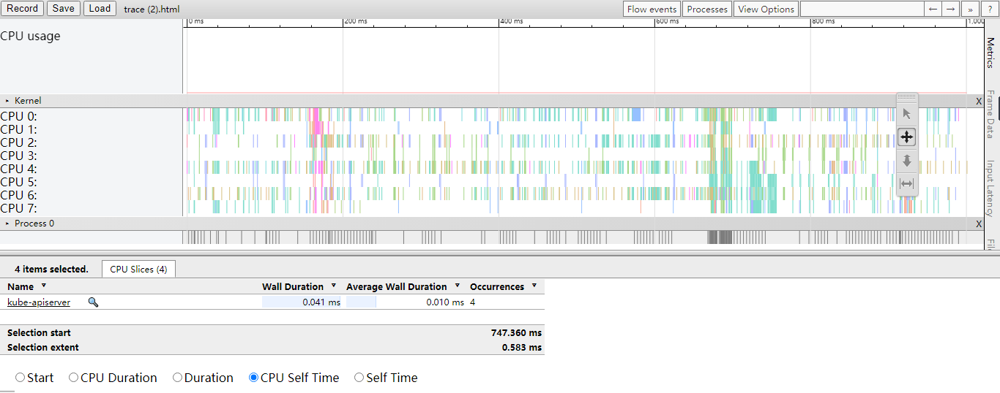

This is systrace script for Linux Desktop/Server

#USAGE
-------

python systrace -h
Usage: systrace [options]

Options:
-h, --help          show this help message and exit
-o FILE             write HTML to FILE
-t N, --time=N      trace for N seconds
-b N, --buf-size=N  use a trace buffer size of N KB
-d, --disk          trace disk I/O (requires root)
-f, --cpu-freq      trace CPU frequency changes
-i, --cpu-idle      trace CPU idle events
-l, --cpu-load      trace CPU load
-s, --no-cpu-sched  inhibit tracing CPU scheduler (allows longer trace times by reducing data rate into buffer)
-w, --workqueue     trace the kernel workqueues (requires root)
-g, --gpu           trace GPU events
-e TRACE_EVENT, --trace-event=TRACE_EVENT	trace Custom events


#DONE
-------

add ext4/block request parser from old systrace


#TODO
-------

  add userspace support library
  integrate with policykit
  ftrace_tracing_mark

#USE -------


```cpp
python systrace  -e "irq,sched/tracing_mark_write"
```


open your chrome tracing page chrome://tracing

Drag trace.html into the chrome window



